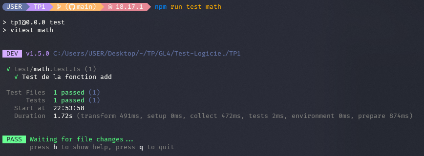
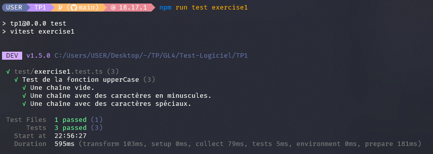
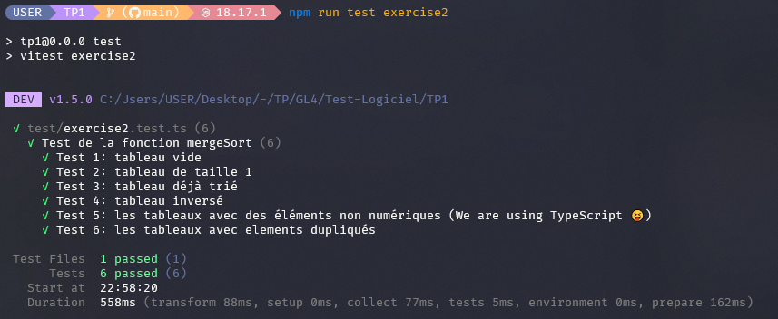
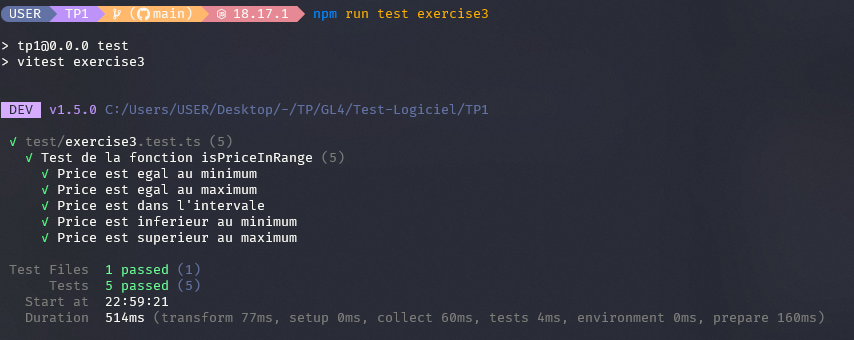
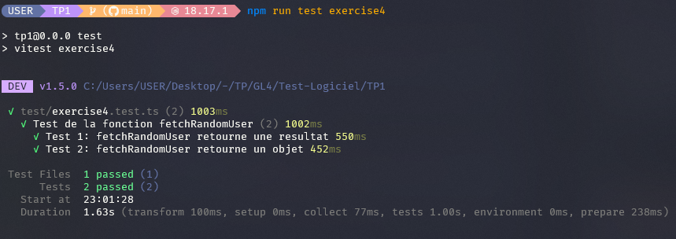
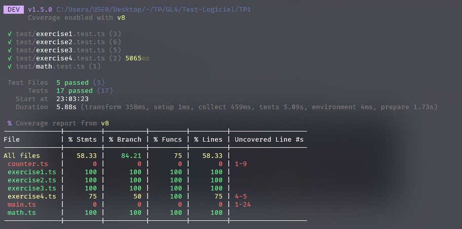

# TP 1: Learn unit testing in JavaScript with Vitest

## Overview
This first assignment focuses on creating a test plan for a software application. A test plan outlines the scope, approach, resources, and schedule for testing activities.

## Objectives

- Understand the importance of unit tests in software development.
- Learn how to write unit tests in JavaScript.
- Master the use of Vitest for executing unit tests.

## Activity 1:

- Test add function from [math.ts](./src/math.ts): [math.test.ts](./test/math.test.ts)

    

## Exercise 1:

- Test uppercase function from [exercise1.ts](./src/exercise1.ts): [exercise1.test.ts](./test/exercise1.test.ts)

    

## Exercise 2:

- Test sort function from [exercise2.ts](./src/exercise2.ts): [exercise2.test.ts](./test/exercise2.test.ts)
  
    

## Exercise 3:

- Test isPriceInRange function from [exercise3.ts](./src/exercise3.ts): [exercise3.test.ts](./test/exercise3.test.ts)
  
    

## Exercise 4:

- Test fetchRandomUser function from [exercise4.ts](./src/exercise4.ts): [exercise4.test.ts](./test/exercise4.test.ts)
  
    

## Code Coverage:

- `npm run test:coverage`

    