# TP 2: Learn E2E testing w/ Selenium

## Overview:
This second assignment focuses on understanding the significance of end-to-end testing in software development, learning to utilize Selenium IDE for automating tests, and creating and executing tests on web applications.

## Objectives:

- Understand the importance of end-to-end testing in software development.
- Learn to use Selenium IDE for test automation.
- Create and run tests on web applications.

## Activity 1: Getting Started with Selenium 

1. Install the Selenium IDE extension. Open the installed extension to access its default interface and create a new project.

    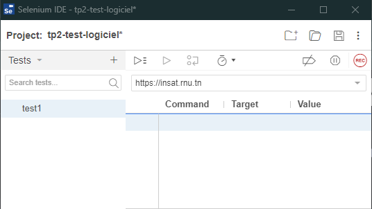
2. Add a base reading URL, start recording your test case. Visit the website you want to test and perform the specific actions you want to include in your test case. Selenium IDE will record these actions as steps in your test case.

    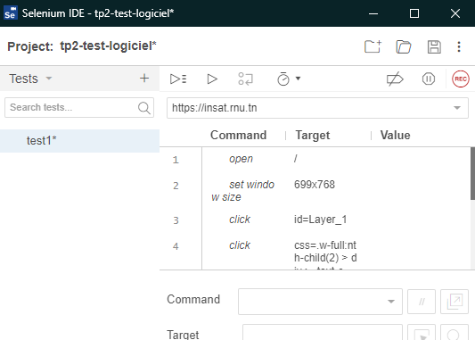

3. You can easily evaluate the summary of your test case by checking the "log" section below, which will help you identify whether any steps have failed or succeeded.

    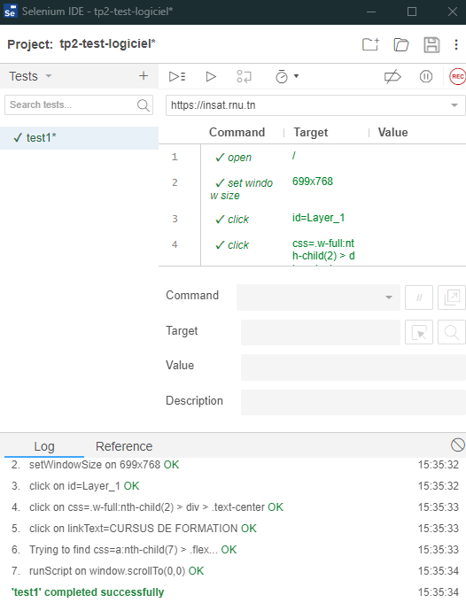

4. Click on the three dots located on the right side of your test, then select "Export" to export your test case in the language of your choice. This allows you to use it with other Selenium tools and frameworks for various testing and automation purposes.

    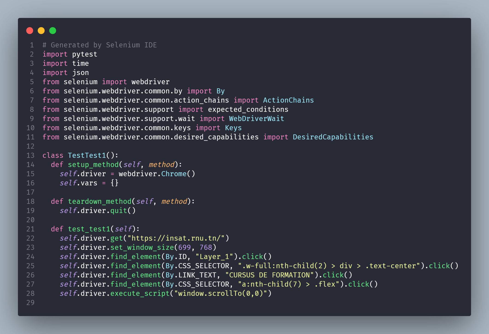

## Assignment:
### Exercise 1: Bonjour

1. Open Selenium IDE.
2. Create a new test in Selenium IDE.
3. Record a new test scenario using the recording tool.
4. Run the test to verify its initial proper functioning.
   
   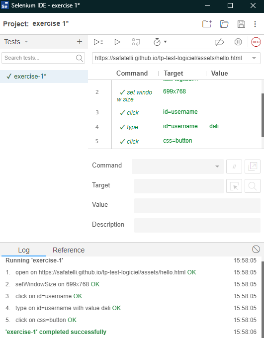

5. Edit the script to change the username value recorded in the previous recording.
6. Add a new "Assert Text" command to verify that the displayed message is correct after clicking the "Hello" button.
   
   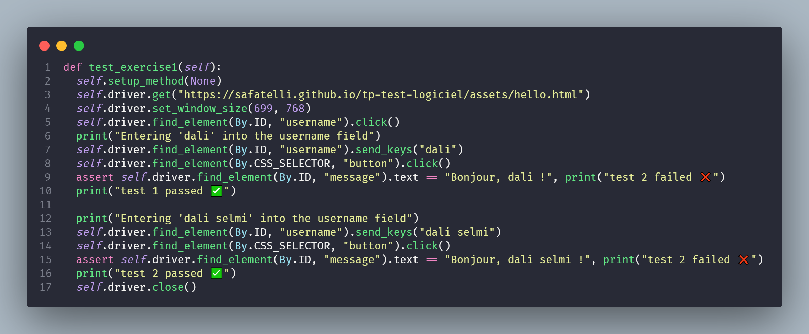

7. Run the test script for two cases: one where the assertion passes and one where the assertion fails, by modifying the username for each case.
   
   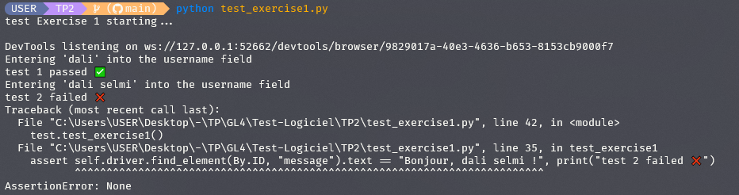

8. Analyze the results and identify discrepancies between expected and actual results.
   
   

9.  Make adjustments to the script if necessary to correct errors or assertion failures.
    ⚠️ **Note:** we need to clear the username field before changing the content again

    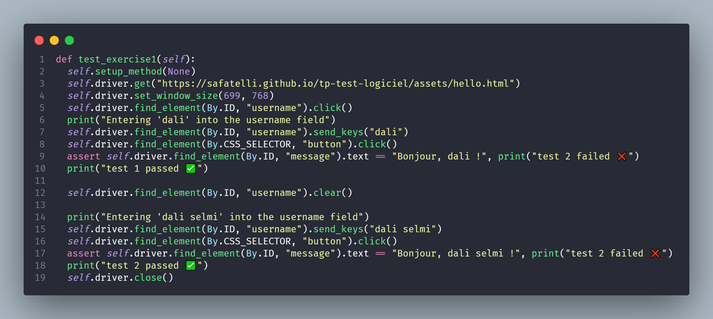

    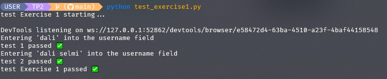

### Exercise 2: Calculator

1. Use Selenium IDE to record a series of actions that test different calculator functions, ensuring to cover the following cases:
2. Test the addition of two numbers.
   
   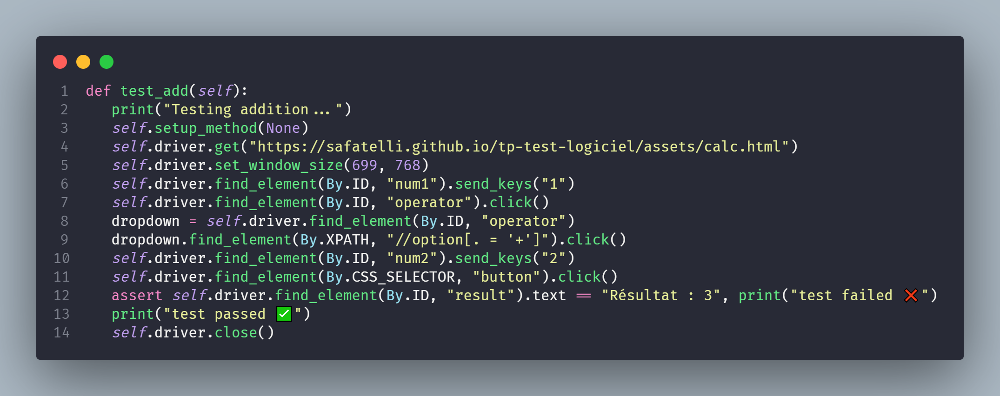
3. Test the subtraction of two numbers.
   
   
4. Test the multiplication of two numbers.
   
   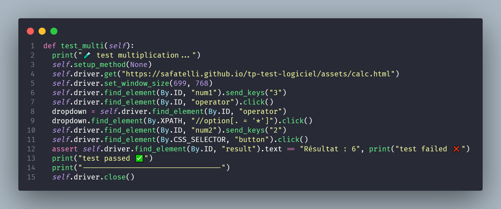
7. Test the division of two numbers.
   
   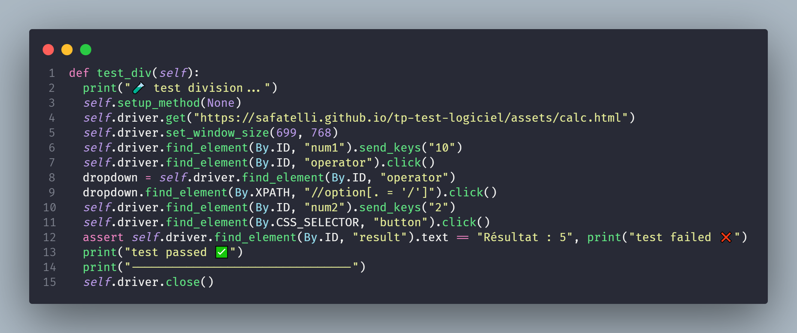
8. Test division by zero and ensure that the appropriate error message is displayed if applicable.

   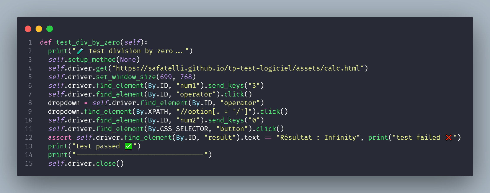
9.  Test cases with null or empty values in the input fields.
10. Add assertions to verify that the displayed results are correct.
11. Organize your tests into logical suites for better management.
12. Run your tests to verify that they all pass successfully.
    
    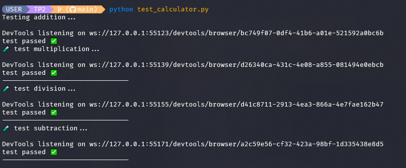

### Exercise 3:

1. Access the demoblaze site in your browser. This site offers a range of fictional products to simulate an online store.
2. Use Selenium IDE to record a series of actions that test different site features, ensuring to cover the following cases:
   - Browse the different product categories available on the site.
        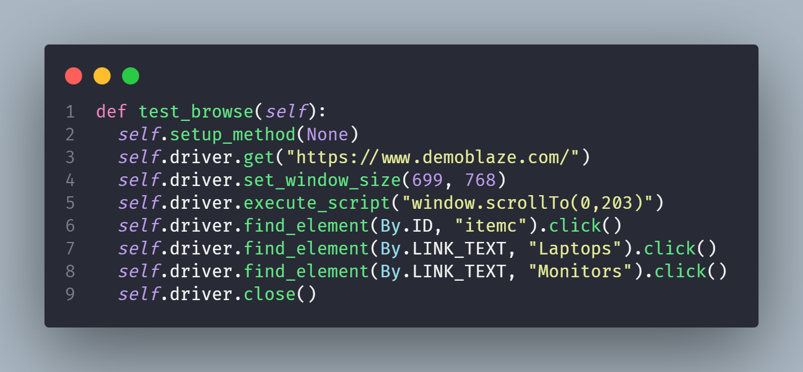
   - Add a product to the cart.
   - Access the cart, verify the added items, and remove any if necessary.
        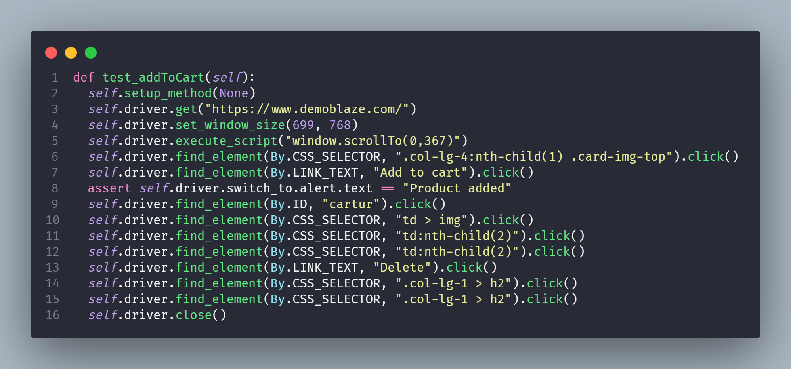
   - Verify the order confirmation after payment.
        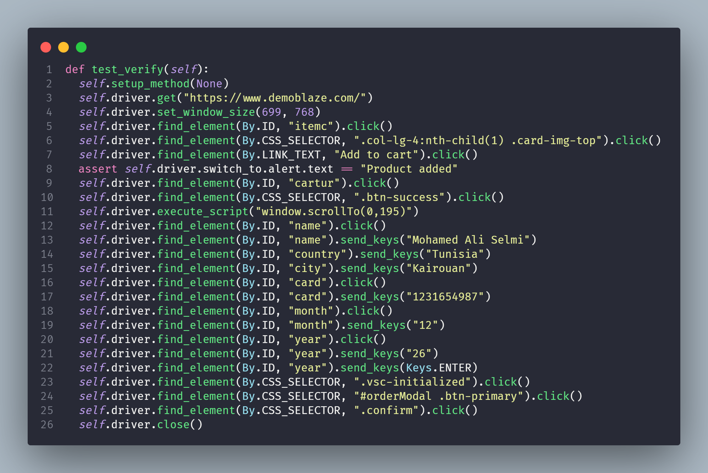
   - Test the search function to find a specific product.
   - Explore additional pages such as the home page, the "About" page, etc.
        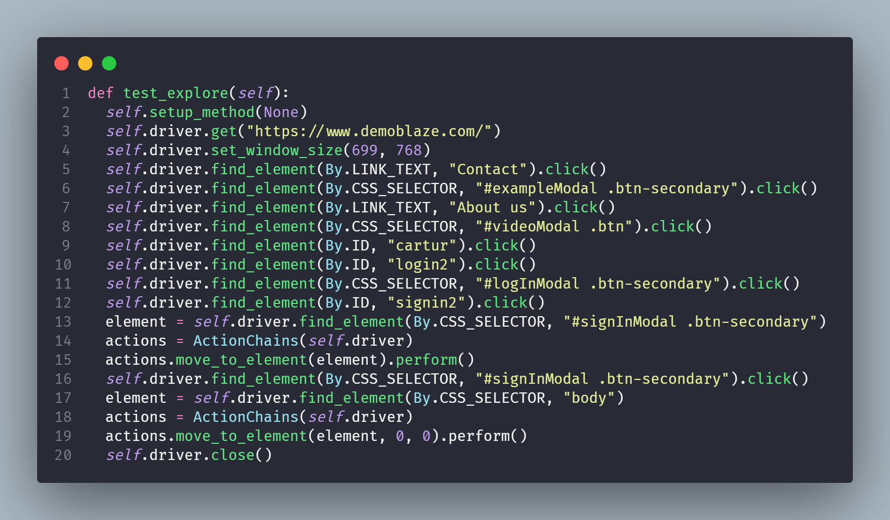
3. Use variables to store data such as product names, delivery addresses, etc., to make your tests more dynamic and reusable.
4. Add assertions to verify that the actions performed produced the expected results.
5. Run your tests to verify that they all pass successfully.
   
   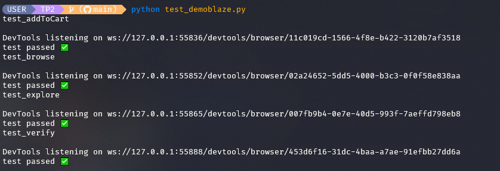